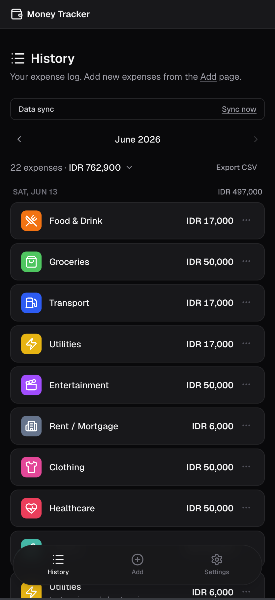
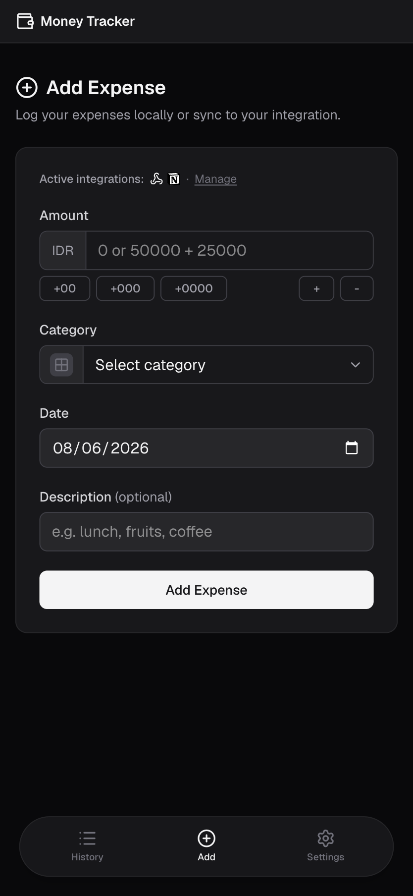
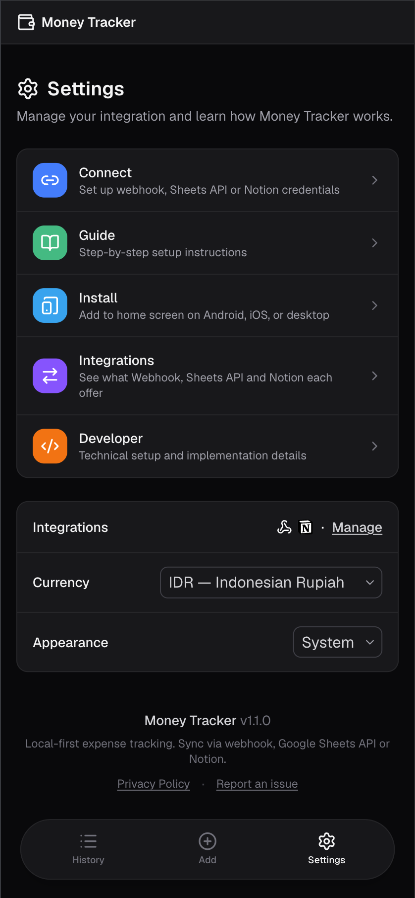

# Money Tracker

Track personal expenses locally with optional sync to a webhook (Zapier, Make, Pipedream, n8n, etc.), Google Sheets, or Notion. Works offline. Installable as a PWA on any device.

**Live demo → [mt.sanudin.dev](https://mt.sanudin.dev)**

<p align="center">
  
  
  
</p>

---

## Features

- Add expenses with category, date, and optional description
- Browse history by month with per-category breakdown
- Edit and delete past entries
- Local-first — data lives on-device (IndexedDB); history always available offline
- Optional sync to a webhook (Zapier, Make, Pipedream, n8n, etc.), Google Sheets, and/or Notion (all can be active simultaneously)
- Multi-currency support
- CSV export — always available from local history
- PWA — install on Android, iOS, or desktop; works fully offline
- Offline sync queue — expenses saved to device and pushed to all active integrations when back online
- Bidirectional sync — "Sync now" pulls remote entries missing on this device and pushes local entries not yet synced (Sheets API and Notion)

---

## Integrations

All integrations are optional and independent — enable none, one, or any combination at the same time.

|              | Webhook                                                                              | Sheets API                        | Notion                                |
| ------------ | ------------------------------------------------------------------------------------ | --------------------------------- | ------------------------------------- |
| Setup        | ~5 min                                                                               | ~2 min                            | ~2 min                                |
| What it does | Sends each expense to any webhook-connected app (Zapier, Make, Pipedream, n8n, etc.) | Writes directly to a Google Sheet | Writes directly to a Notion database  |
| Multi-device | Not supported                                                                        | Yes — bidirectional sync          | Yes — bidirectional sync              |
| Cost         | Depends on platform                                                                  | Free                              | Free                                  |

See the [Integrations page](https://mt.sanudin.dev/compare) for details.

---

## Stack

Next.js 16 App Router · TypeScript · Tailwind CSS · IndexedDB (`idb`) · Zod · `@ducanh2912/next-pwa`

---

## Architecture

Money Tracker is **local-first** — all expense data lives in IndexedDB on the user's device. The app works fully offline; the network is only ever used for optional sync.

**Data flow:**
1. Every expense is written to IndexedDB before any network call is made — data is never lost even if sync fails
2. History always reads from IndexedDB — no remote fetch required
3. On submit, the app fires sync calls to all active integrations in parallel (webhook, Sheets API and/or Notion)
4. If offline, failed syncs are queued per integration in `localStorage` and retried automatically on reconnect

**API routes are thin proxies** — the Next.js server routes forward credentials and payloads to Google, Notion or the webhook URL. They hold no state and access no database. Credentials stay in `localStorage` on the client and are sent with each request.

**Integrations are independent output channels** — all can be active simultaneously. A webhook failure never blocks a Sheets write or a Notion write, and vice versa. Each has its own offline queue.

---

## Run locally

```bash
git clone https://github.com/sanudin-dev/money-tracker
cd money-tracker
npm install
npm run dev
```

**Works immediately without any credentials** — expenses save locally to IndexedDB.

To enable integrations, create `.env.local` (see `.env.example`):

```env
# Required for Google Sheets sync (OAuth)
GOOGLE_CLIENT_ID=your_client_id
GOOGLE_CLIENT_SECRET=your_client_secret

# Required for Google Sheets and/or Notion (token encryption)
ENCRYPTION_KEY=<output of: openssl rand -base64 32>
```

Notion only needs `ENCRYPTION_KEY` — no OAuth setup required.

See the [Developer page](https://mt.sanudin.dev/dev) for the full setup guide per integration.

---

## Deploy

Standard Next.js app — deploy to [Vercel](https://vercel.com), [Netlify](https://netlify.com), [Render](https://render.com), or any Node.js host. No database required.

Set these environment variables on your host:

```
# Google Sheets sync (OAuth)
GOOGLE_CLIENT_ID
GOOGLE_CLIENT_SECRET

# Google Sheets and/or Notion (token encryption)
ENCRYPTION_KEY
```

Notion only needs `ENCRYPTION_KEY`. For Google Sheets, also add your production domain's callback URL to Google Cloud Console:
`https://your-domain.com/api/auth/google/callback`

---

## Install on your device

Open [mt.sanudin.dev](https://mt.sanudin.dev) in a browser and follow the [Install guide](https://mt.sanudin.dev/install):

- **Android**: Chrome → menu → Add to Home Screen
- **iOS**: Safari → Share → Add to Home Screen
- **Desktop**: Chrome or Edge → install icon in address bar
